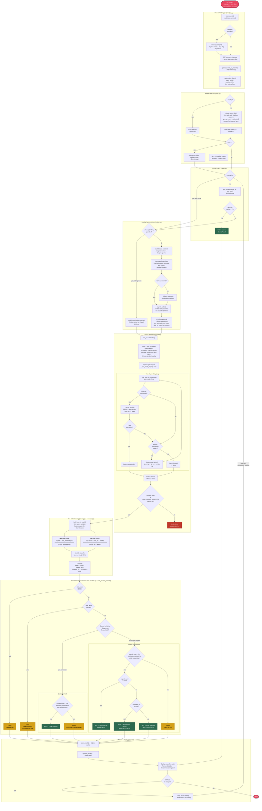

# PQI Analyze Pipeline — Logical Flow

```mermaid
flowchart TD
    START(["pqi analyze<br/>--category, --top, --live,<br/>--starts-within, --no-cache"])

    subgraph FETCH["Market Fetching  (polymarket.py)"]
        F1["fetch_events()<br/>_build_api_params()"]
        F2{"category<br/>provided?"}
        F3["resolve_category()<br/>3-pass: series → tag slug → tag partial"]
        F4["GET /events or /markets<br/>+ server-side volume filter"]
        F5["_parse_events_to_markets()<br/>→ List[EventGroup]"]
        F6["_apply_client_filters()<br/>starts_within, resolve_within,<br/>live, volume floor"]
    end

    subgraph SELECT["Market Selection  (main.py)"]
        S1{"--top flag?"}
        S2["Auto-select #1<br/>by volume"]
        S3["display_event_list()<br/>Rich table with Sig/Seen columns<br/>prompt_event_multiselect()<br/>accepts list/range/all spec"]
        S4["User picks event(s) → market(s)"]
        S5{"N == 1?"}
        S6["Sub-market picker +<br/>sibling prompt (EventGroup)"]
        S7["N &gt;= 2: headline market<br/>per event → batch path"]
    end

    subgraph CACHE_CHECK["Cache Check  (cache.py)"]
        C1{"--no-cache?"}
        C2["get_cached(market_id, yes_price)<br/>SQLite lookup"]
        C3{"Cache hit?<br/>Δprice < 2%"}
        C4["Return cached<br/>CouncilResult"]
    end

    subgraph BRIEFING["Briefing Synthesis  (synthesizer.py)"]
        B1{"shared_briefing<br/>provided?"}
        B2["model_copy(update=market)<br/>Rebind market on shared briefing"]
        B3["LLM Search Architect<br/>Analyzes market → designs queries"]
        B4["Generate SearchPlan<br/>List[TavilyQuery] with topic,<br/>time_range, include_domains"]
        B5{"LLM succeeded?"}
        B6["_fallback_queries()<br/>Hardcoded templates"]
        B7["asyncio.gather()<br/>parallel Tavily searches<br/>via AsyncTavilyClient"]
        B8["LLM Synthesis call<br/>→ BriefingDocument<br/>key_facts, side_yes_case,<br/>side_no_case, key_context"]
    end

    subgraph COUNCIL["Council of Seven  (council.py)"]
        CO1["run_council(briefing)"]
        CO2["Build 7 user messages<br/>Rules Lawyer: resolution_criteria injection<br/>Bull/Bear: SIDE CONTEXT block<br/>Others: standard briefing"]
        CO3["asyncio.gather() × 7<br/>_run_single_agent() each"]

        subgraph RETRY["Per-Agent Retry Loop"]
            R1["_call_llm() via client.chat()<br/>json_mode=True"]
            R2{"LLM call<br/>succeeded?"}
            R3["_parse_verdict()<br/>JSON → AgentVerdict<br/>÷100 for 0-1 scale"]
            R4{"Parse<br/>succeeded?"}
            R5{"Retries<br/>remaining?<br/>(max 5)"}
            R6["Exponential backoff<br/>1s → 2s → 4s → ... → 30s cap"]
            R7["Agent dropped<br/>→ None"]
            R8["Return AgentVerdict"]
        end

        CO4["Collect verdicts<br/>filter out None"]
        CO5{"Quorum met?<br/>≥ MIN_COUNCIL_VERDICTS<br/>(default 5/7)"}
        CO6["RuntimeError<br/>Analysis aborted"]
    end

    subgraph SCORING["Two-Sided Scoring  (scoring.py → models.py)"]
        SC1["build_council_result()<br/>Wire agent_weights:<br/>Rules Lawyer=2×, Bear=tunable"]
        SC2["<b>YES-side score:</b><br/>Σ(prob × conf_yes × weight)<br/>─────────────────────<br/>Σ(conf_yes × weight)"]
        SC3["<b>NO-side score:</b><br/>Σ((1-prob) × conf_no × weight)<br/>──────────────────────────<br/>Σ(conf_no × weight)"]
        SC4["Identify council's<br/>favored side (>50%)"]
        SC5["Compute:<br/>edge = score − market_price<br/>expected_roi = (1 − price) / price"]
    end

    subgraph GATES["Recommendation Decision Tree  (models.py :: from_council_verdicts)"]
        G1{"side_price<br/>< $0.05?"}
        G2["PASS<br/><i>Price too low</i>"]
        G3{"side_price<br/>> $0.90?"}
        G4["PASS<br/><i>Near-resolved,<br/>ROI not worth risk</i>"]
        G5{"Council vs Market<br/>disagree on<br/>favored side?"}

        subgraph CONTRARIAN["Contrarian Path"]
            CT1{"council_prob ≥ 70%<br/>AND side_conf ≥ 80%<br/>AND ROI ≥ 20%?"}
            CT2["BUY → CONTRARIAN"]
            CT3["PASS<br/><i>Contrarian criteria not met</i>"]
        end

        subgraph ALIGNED["Market-Aligned Path"]
            AL1{"council_prob ≥ 57%<br/>AND side_conf ≥ 67%<br/>AND ROI ≥ 10%?"}
            AL2{"expected_roi<br/>≥ 50%?"}
            AL3["BUY → HIGH VALUE<br/><i>price ≤ ~$0.67</i>"]
            AL4{"expected_roi<br/>≥ 25%?"}
            AL5["BUY → MODERATE VALUE<br/><i>price ~$0.67–$0.80</i>"]
            AL6["BUY → LOW MARGIN<br/><i>price ~$0.80–$0.91</i>"]
            AL7["PASS<br/><i>Gates not met</i>"]
        end
    end

    subgraph PERSIST["Persist & Display  (main.py)"]
        P1["store_result() → SQLite cache"]
        P2["append_result() → history.jsonl"]
        P3["display_council_result()<br/>Rich verdict table +<br/>Recommendation panel"]
        P4{"Siblings<br/>to analyze?"}
        P5["Loop: reuse briefing<br/>→ fresh council per sibling"]
    end

    %% Main flow
    START --> F1
    F1 --> F2
    F2 -->|yes| F3 --> F4
    F2 -->|no| F4
    F4 --> F5 --> F6

    F6 --> S1
    S1 -->|yes| S2 --> S5
    S1 -->|no| S3 --> S4 --> S5
    S5 -->|yes| S6 --> C1
    S5 -->|no| C1

    C1 -->|yes, skip cache| B1
    C1 -->|no| C2
    C2 --> C3
    C3 -->|yes| C4 --> P3
    C3 -->|no| B1

    B1 -->|yes, sibling reuse| B2 --> CO1
    B1 -->|no| B3
    B3 --> B4 --> B5
    B5 -->|yes| B7
    B5 -->|no| B6 --> B7
    B7 --> B8 --> CO1

    CO1 --> CO2 --> CO3
    CO3 --> R1
    R1 --> R2
    R2 -->|yes| R3
    R2 -->|no| R5
    R3 --> R4
    R4 -->|yes| R8
    R4 -->|no| R5
    R5 -->|yes| R6 --> R1
    R5 -->|no| R7
    R8 --> CO4
    R7 --> CO4

    CO4 --> CO5
    CO5 -->|yes| SC1
    CO5 -->|no| CO6

    SC1 --> SC2 & SC3
    SC2 & SC3 --> SC4 --> SC5

    SC5 --> G1
    G1 -->|yes| G2
    G1 -->|no| G3
    G3 -->|yes| G4
    G3 -->|no| G5
    G5 -->|yes, contrarian| CT1
    CT1 -->|yes| CT2
    CT1 -->|no| CT3
    G5 -->|no, market-aligned| AL1
    AL1 -->|yes| AL2
    AL1 -->|no| AL7
    AL2 -->|yes| AL3
    AL2 -->|no| AL4
    AL4 -->|yes| AL5
    AL4 -->|no| AL6

    CT2 & CT3 & AL3 & AL5 & AL6 & AL7 & G2 & G4 --> P1
    P1 --> P2 --> P3
    P3 --> P4
    P4 -->|yes| P5 -->|"loop back<br/>with shared_briefing"| C1
    P4 -->|no| END(["Done"])

    %% Styling
    style START fill:#e94560,stroke:#1a1a2e,color:#fff
    style END fill:#e94560,stroke:#1a1a2e,color:#fff
    style C4 fill:#2d6a4f,stroke:#1b4332,color:#fff
    style CT2 fill:#2d6a4f,stroke:#1b4332,color:#fff
    style AL3 fill:#2d6a4f,stroke:#1b4332,color:#fff
    style AL5 fill:#2d6a4f,stroke:#1b4332,color:#fff
    style AL6 fill:#2d6a4f,stroke:#1b4332,color:#fff
    style G2 fill:#d4a017,stroke:#8b6914,color:#000
    style G4 fill:#d4a017,stroke:#8b6914,color:#000
    style CT3 fill:#d4a017,stroke:#8b6914,color:#000
    style AL7 fill:#d4a017,stroke:#8b6914,color:#000
    style CO6 fill:#c0392b,stroke:#922b21,color:#fff
```
