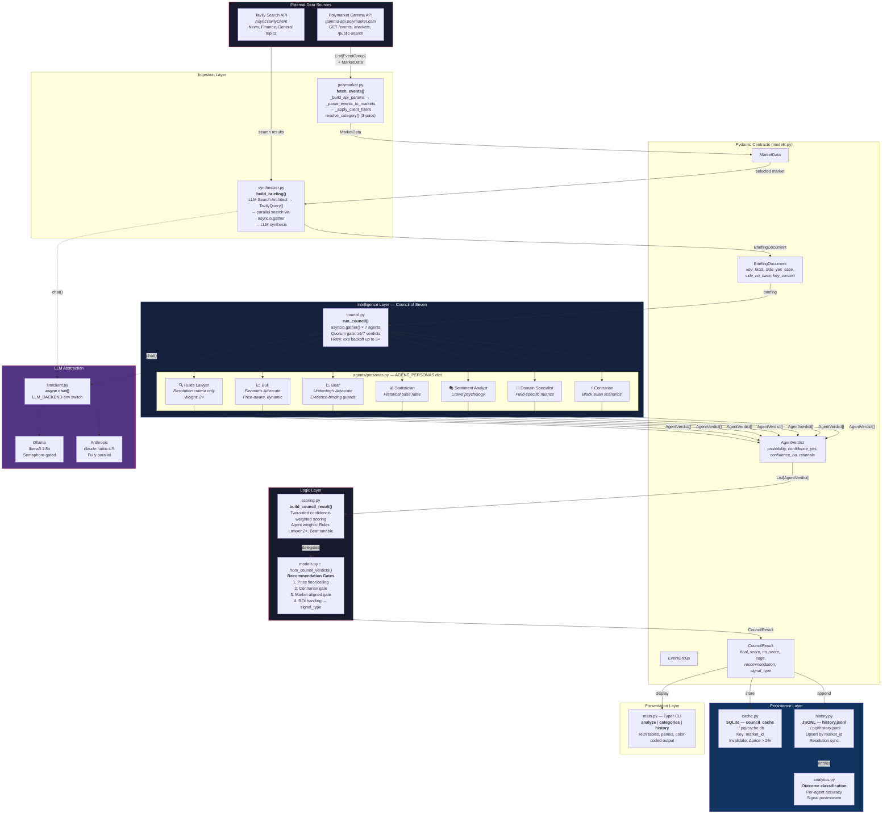

# PQI System Architecture

```mermaid
graph TB
    subgraph External["External Data Sources"]
        GAMMA["Polymarket Gamma API<br/><i>gamma-api.polymarket.com</i><br/>GET /events, /markets, /public-search"]
        TAVILY["Tavily Search API<br/><i>AsyncTavilyClient</i><br/>News, Finance, General topics"]
    end

    subgraph Ingestion["Ingestion Layer"]
        POLY["polymarket.py<br/><b>fetch_events()</b><br/>_build_api_params → _parse_events_to_markets<br/>→ _apply_client_filters<br/>resolve_category() (3-pass)"]
        SYNTH["synthesizer.py<br/><b>build_briefing()</b><br/>LLM Search Architect → TavilyQuery[]<br/>→ parallel search via asyncio.gather<br/>→ LLM synthesis"]
    end

    subgraph Models["Pydantic Contracts  (models.py)"]
        MD["MarketData"]
        EG["EventGroup"]
        BD["BriefingDocument<br/><i>key_facts, side_yes_case,<br/>side_no_case, key_context</i>"]
        AV["AgentVerdict<br/><i>probability, confidence_yes,<br/>confidence_no, rationale</i>"]
        CR["CouncilResult<br/><i>final_score, no_score, edge,<br/>recommendation, signal_type</i>"]
    end

    subgraph Intelligence["Intelligence Layer — Council of Seven"]
        COUNCIL["council.py<br/><b>run_council()</b><br/>asyncio.gather() × 7 agents<br/>Quorum gate: ≥5/7 verdicts<br/>Retry: exp backoff up to 5×"]

        subgraph Agents["agents/personas.py — AGENT_PERSONAS dict"]
            RL["🔍 Rules Lawyer<br/><i>Resolution criteria only<br/>Weight: 2×</i>"]
            BULL["📈 Bull<br/><i>Favorite's Advocate<br/>Price-aware, dynamic</i>"]
            BEAR["📉 Bear<br/><i>Underdog's Advocate<br/>Evidence-binding guards</i>"]
            STAT["📊 Statistician<br/><i>Historical base rates</i>"]
            SENT["🎭 Sentiment Analyst<br/><i>Crowd psychology</i>"]
            SPEC["🔬 Domain Specialist<br/><i>Field-specific nuance</i>"]
            CONT["⚡ Contrarian<br/><i>Black swan scenarios</i>"]
        end
    end

    subgraph Logic["Logic Layer"]
        SCORING["scoring.py<br/><b>build_council_result()</b><br/>Two-sided confidence-weighted scoring<br/>Agent weights: Rules Lawyer 2×, Bear tunable"]
        RECOM["models.py :: from_council_verdicts()<br/><b>Recommendation Gates</b><br/>1. Price floor/ceiling<br/>2. Contrarian gate<br/>3. Market-aligned gate<br/>4. ROI banding → signal_type"]
    end

    subgraph Persistence["Persistence Layer"]
        CACHE["cache.py<br/><b>SQLite — council_cache</b><br/>~/.pqi/cache.db<br/>Key: market_id<br/>Invalidate: Δprice > 2%"]
        HISTORY["history.py<br/><b>JSONL — history.jsonl</b><br/>~/.pqi/history.jsonl<br/>Upsert by market_id<br/>Resolution sync"]
        ANALYTICS["analytics.py<br/><b>Outcome classification</b><br/>Per-agent accuracy<br/>Signal postmortem"]
    end

    subgraph Presentation["Presentation Layer"]
        CLI["main.py — Typer CLI<br/><b>analyze</b> | <b>categories</b> | <b>history</b><br/>Rich tables, panels, color-coded output"]
    end

    subgraph LLM["LLM Abstraction"]
        CLIENT["llm/client.py<br/><b>async chat()</b><br/>LLM_BACKEND env switch"]
        OLLAMA["Ollama<br/>llama3.1:8b<br/>Semaphore-gated"]
        ANTHROPIC["Anthropic<br/>claude-haiku-4-5<br/>Fully parallel"]
    end

    %% Data flow
    GAMMA -->|"List[EventGroup]<br/>+ MarketData"| POLY
    POLY -->|"MarketData"| MD
    MD -->|"selected market"| SYNTH
    TAVILY -->|"search results"| SYNTH
    SYNTH -->|"BriefingDocument"| BD
    BD -->|"briefing"| COUNCIL
    COUNCIL --> RL & BULL & BEAR & STAT & SENT & SPEC & CONT
    RL & BULL & BEAR & STAT & SENT & SPEC & CONT -->|"AgentVerdict[]"| AV
    AV -->|"List[AgentVerdict]"| SCORING
    SCORING -->|"delegates"| RECOM
    RECOM -->|"CouncilResult"| CR
    CR -->|"store"| CACHE
    CR -->|"append"| HISTORY
    HISTORY -->|"entries"| ANALYTICS
    CR -->|"display"| CLI

    COUNCIL -.->|"chat()"| CLIENT
    SYNTH -.->|"chat()"| CLIENT
    CLIENT -.-> OLLAMA
    CLIENT -.-> ANTHROPIC

    style External fill:#1a1a2e,stroke:#e94560,color:#fff
    style Intelligence fill:#16213e,stroke:#0f3460,color:#fff
    style Logic fill:#1a1a2e,stroke:#e94560,color:#fff
    style Persistence fill:#0f3460,stroke:#533483,color:#fff
    style LLM fill:#533483,stroke:#e94560,color:#fff
```
